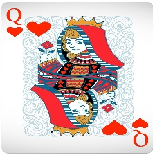
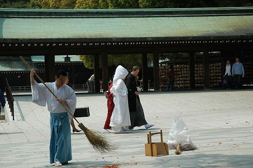
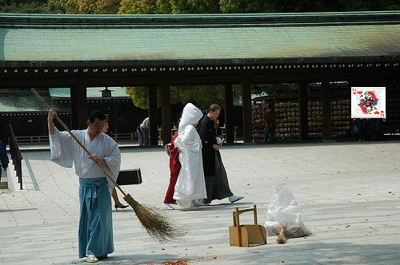
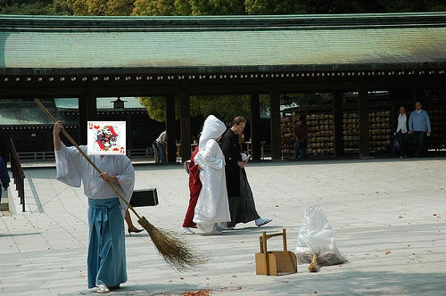
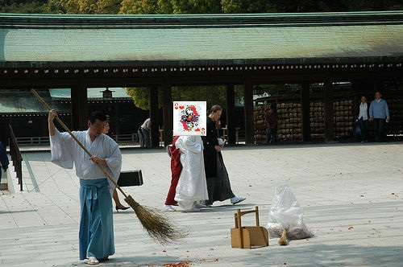
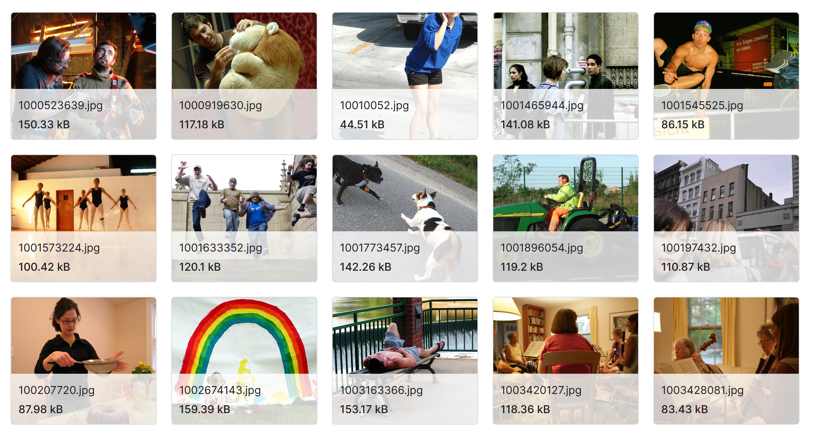

# Find and classify the hidden playing card during image captioning - combining two models.

Deep Learning project

---
# Team
Antonio Georgiev, 0MI0600089
Bojidar Goranov, 0MI0600022
Teodor Kostadinov, 4MI0600097
 

---

# Idea

The purpose of this project is to attempt combining **two pre trained** models - a card **classification model** and an **image captioning model**. The expected result is to have a model that can **both find** and **identify the card** on an image taken from Google Maps street view.

---

# Card classification model
- [Cards Image Dataset-Classification](https://www.kaggle.com/datasets/gpiosenka/cards-image-datasetclassification/data) in Kaggle
- Use a pre-trained **CNN** model.

---
# Image captioning model
- [Flickr Image dataset](https://www.kaggle.com/datasets/hsankesara/flickr-image-dataset) in Kaggle
- Use a pre-trained **CNN** model.

---
# Data

Combining the two datasets - **enormous** number of possible input files.

- **7624** cards training images
- **31783** Flickr images

---

---

---

---

---

---

# Technologies

---

# Difficulties

- Creating and labeling the input data.
- Defining the exact output format that we want.

---
# Relevant papers

---
# Thank you
